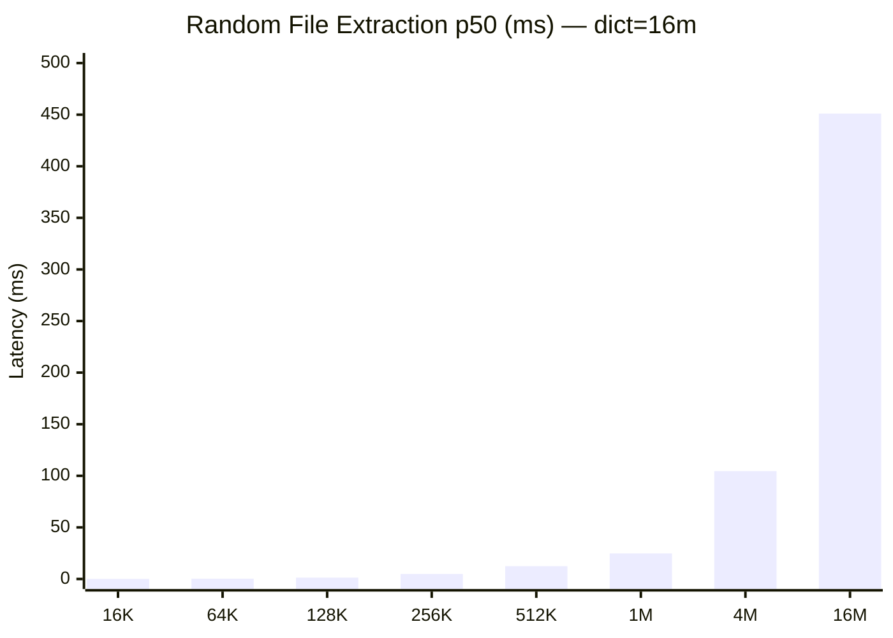
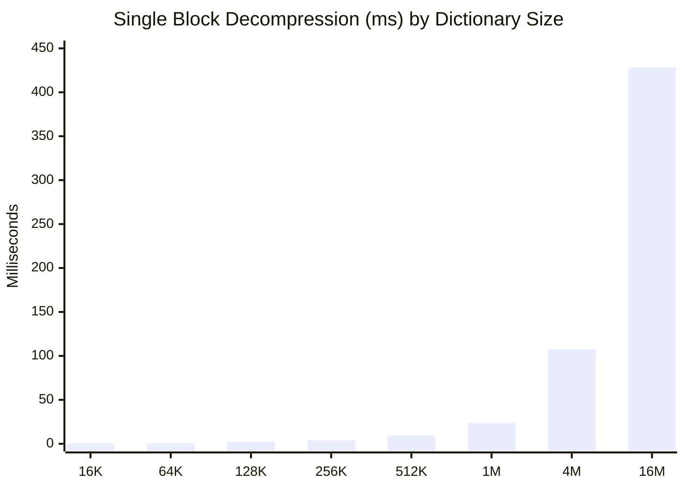
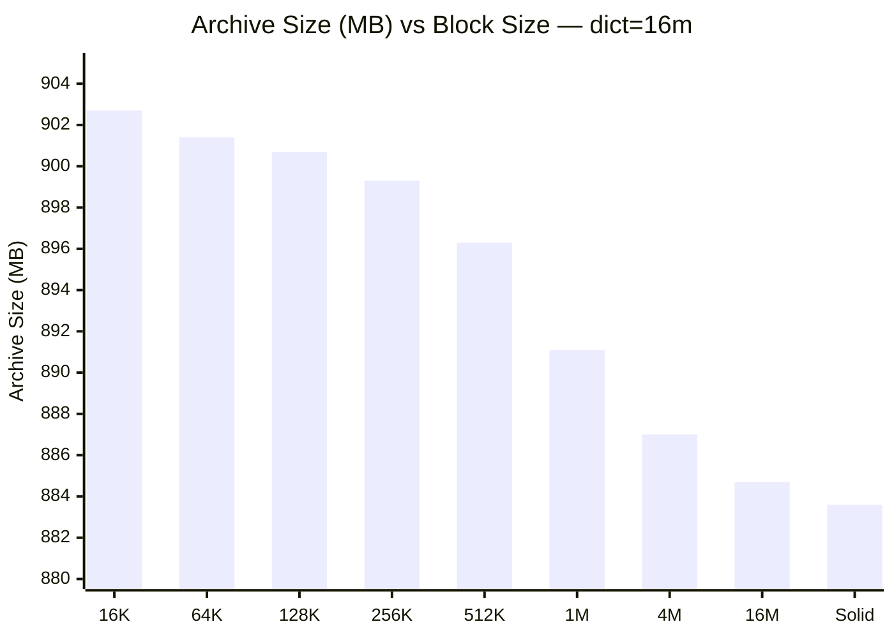
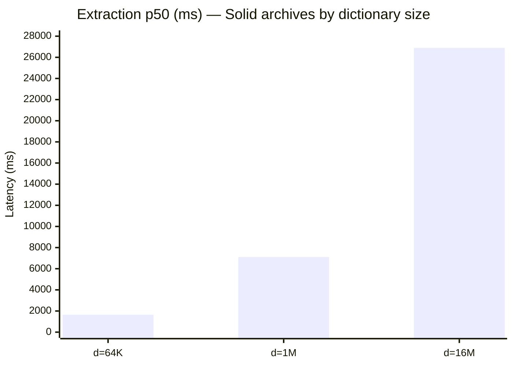

# 7z-benchmark — LZMA2 Compression vs Random Access Benchmark

Systematic benchmarking of how 7z archive parameters (dictionary size, solid block size) affect **random single-file extraction latency** — the metric that matters most for archive-as-filesystem use cases.

## What It Does

- Creates a test dataset of mixed files (images, text, binary) across many folders
- Compresses with a matrix of dictionary sizes × solid block sizes
- Measures **cold random extraction** latency (p50, avg, max) for each configuration
- Generates a Markdown report with performance tables and recommendations

## Build

```bash
make
```

## Usage

```bash
# Full benchmark (all configurations, takes ~1 hour)
./7z-bench --output report.md

# Quick mode (subset of configs)
./7z-bench --quick --output report.md
```

---

## Results

### System & Test Parameters

| Parameter | Value |
|---|---|
| OS | Darwin 24.6.0 arm64 (Apple Silicon) |
| Extraction API | `SzArEx_Extract` (LZMA SDK C API) |
| Random samples | 20 cold extractions per config |
| Total benchmark time | 4,433 sec (~74 min) |

### Random Access Time vs Block Size

Extraction latency grows linearly with block size. Dictionary size has minimal effect at the same block size:



> ⚠️ Solid archive (`-ms=on`) with d=16m: **26,898 ms** — too large for the chart!

### Block Decompression Time

Single-block decompression time across all three dictionary sizes:



### Compression Ratio vs Block Size (dict=16m)

Larger blocks compress better, but gains diminish rapidly:



> Only **2.2% difference** between 16K blocks and solid — but **269,000×** difference in extraction speed.

### Full Extraction Data (dict=16m)

| Block | Blocks | p50 (ms) | Max (ms) | Archive Size | Verdict |
|-------|-------:|---------:|---------:|:------------:|---------|
| 16K | 29,213 | **0.1** | 1.2 | 902.7 MB | ⚡ Instant |
| 64K | 19,953 | **0.3** | 2.3 | 901.4 MB | ⚡ Instant |
| 128K | 9,645 | **1.3** | 4.2 | 900.7 MB | ⚡ Instant |
| 256K | 4,079 | 4.9 | 8.7 | 899.3 MB | ✅ Fast |
| 512K | 1,930 | 12.4 | 16.8 | 896.3 MB | ✅ Fast |
| 1M | 940 | 24.8 | 34.1 | 891.1 MB | ✅ Acceptable |
| 4M | 230 | 104.5 | 129.0 | 887.0 MB | ⚠️ Noticeable |
| 16M | 58 | 451.0 | 490.6 | 884.7 MB | ❌ Slow |
| Solid | 1 | **26,898** | 27,131 | 883.6 MB | 🔴 Unusable |

### Dictionary Size Comparison (same block sizes)



| Dict | Block=256K | Block=1M | Block=Solid |
|------|----------:|--------:|-----------:|
| 64K | 3.4 ms | 23.9 ms | 1,647 ms |
| 1M | 4.9 ms | 27.1 ms | 7,109 ms |
| 16M | 4.9 ms | 24.8 ms | **26,898 ms** |

> At small block sizes, dictionary doesn't matter. At solid, larger dictionaries are **catastrophically slower** because the entire archive is one decompression unit.

---

## Recommended Command

```bash
# Best random access with reasonable compression:
7z a -m0=lzma2:d=1m -ms=16k archive.7z files/
```

This creates an archive where any individual file can be extracted in **< 1 ms**.

### Key Takeaways

- **Solid block size** is the primary control for random access speed — smaller blocks = faster single-file extraction
- **Dictionary size** primarily affects compression ratio and has negligible effect at small block sizes
- For archives you'll extract individual files from, **prioritize block size** (`-ms=16k` to `-ms=128k`)
- For backup/archival with full extraction only, use solid (`-ms=on`) for best ratio

## Parameters Tested

| Parameter | Values |
|-----------|--------|
| Dictionary size (`d=`) | 64K, 1M, 16M |
| Solid block size (`ms=`) | 16K, 64K, 128K, 256K, 512K, 1M, 4M, 16M, 32M, `on` (solid) |
| Extraction method | `SzArEx_Extract` (LZMA SDK C API) |
| Samples per config | 20 cold extractions |
