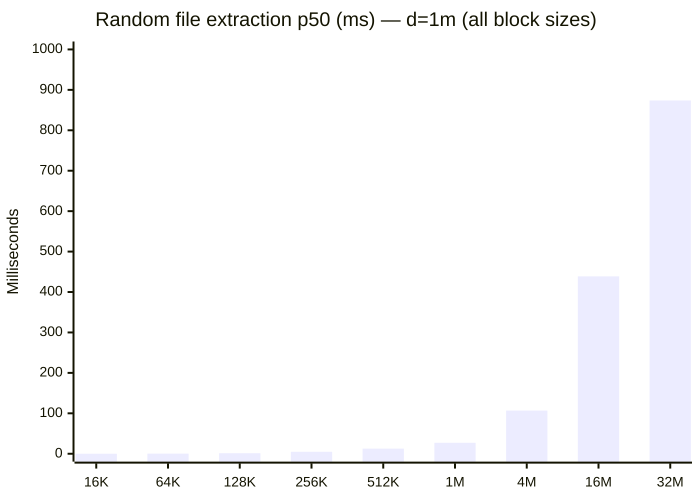
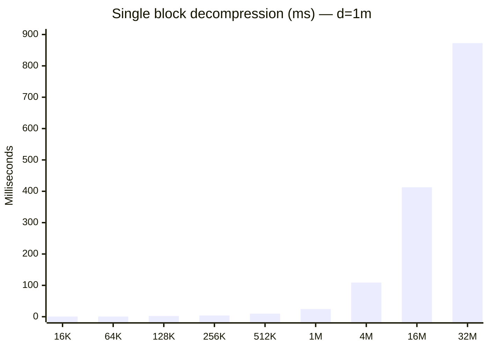
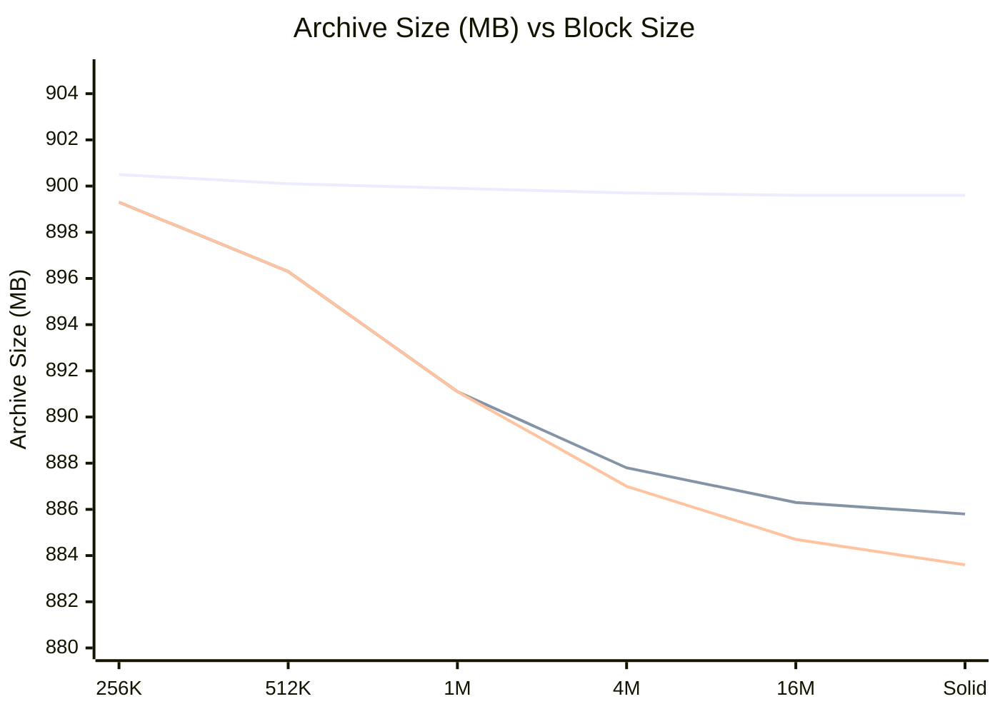
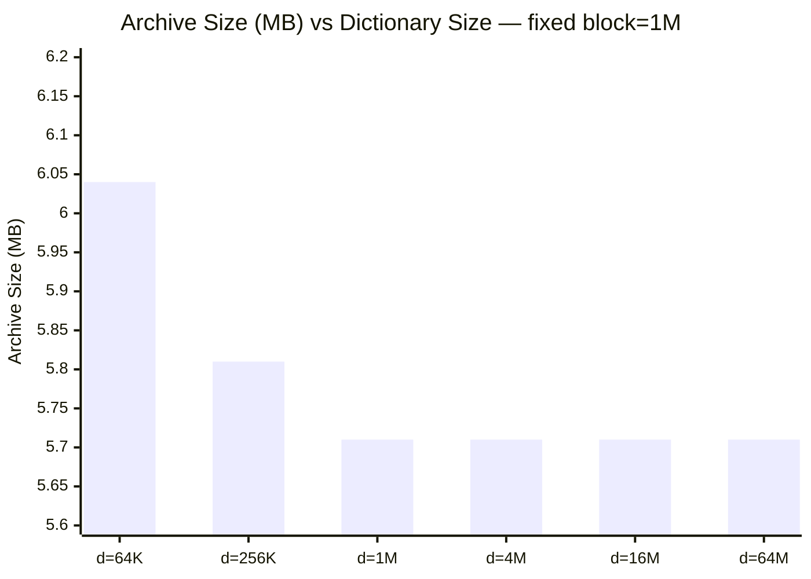
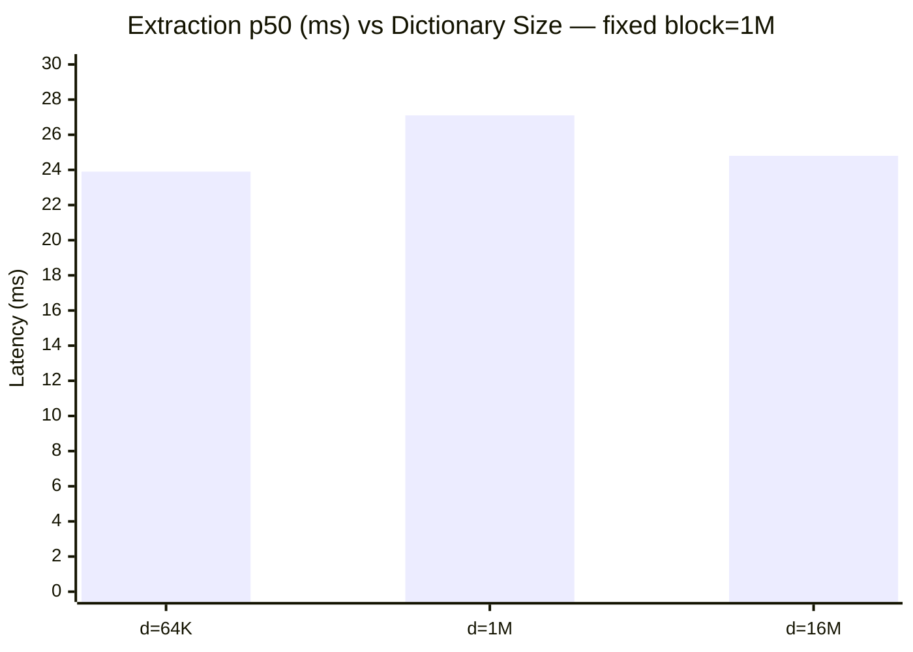
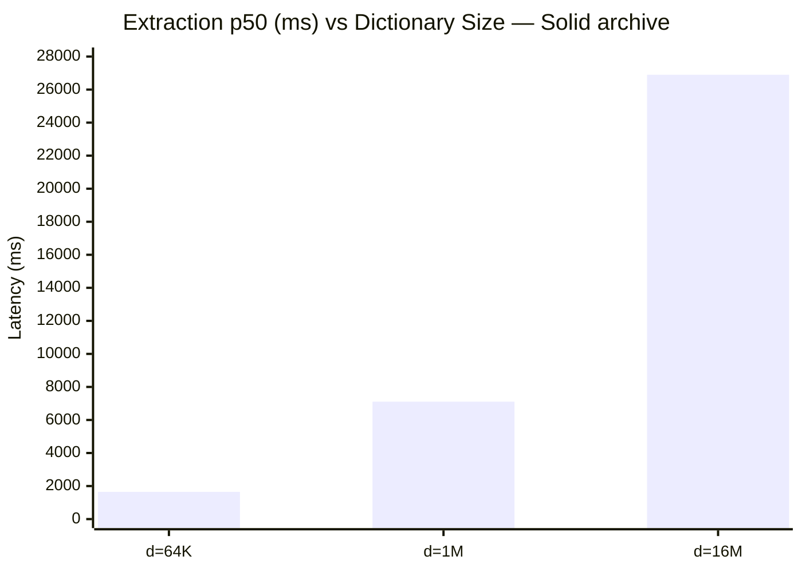

# 7z Compression Benchmark Report

## System & Test Parameters

| Parameter | Value |
|---|---|
| OS | Darwin 24.6.0 arm64 |
| Test data | 0 files in 200 folders (0.0 MB) |
| Extraction API | SzArEx_Extract (fast7z method) |
| Random samples | 20 cold extractions per config |
| Total benchmark time | 4433.1 sec |

## Compression & Extraction Performance

| Dict | Block | Ratio | Archive | Create(s) | Extract MB/s | Blocks | Block(ms) | Rnd p50(ms) | Rnd max(ms) |
|------|-------|------:|--------:|----------:|------------:|-------:|----------:|------------:|------------:|
| 64k | 256k | N/A | 900.5M | 84.0 | 0.0 | 4079 | 3.9 | 3.4 | 8.4 |
| 64k | 512k | N/A | 900.1M | 86.3 | 0.0 | 1930 | 9.0 | 10.6 | 17.2 |
| 64k | 1m | N/A | 899.9M | 92.2 | 0.0 | 940 | 22.9 | 23.9 | 33.4 |
| 64k | 4m | N/A | 899.7M | 86.9 | 0.0 | 230 | 97.4 | 95.3 | 119.2 |
| 64k | 16m | N/A | 899.6M | 81.3 | 0.0 | 58 | 384.5 | 403.5 | 458.0 |
| 64k | 32m | N/A | 899.6M | 90.2 | 0.0 | 29 | 847.9 | 797.8 | 897.5 |
| 64k | on | N/A | 899.6M | 91.7 | 0.0 | 15 | 1693.1 | 1647.1 | 1750.2 |
| 1m | 16k | N/A | 902.7M | 71.3 | 0.0 | 29213 | 0.6 | 0.1 | 1.1 |
| 1m | 64k | N/A | 901.4M | 74.0 | 0.0 | 19953 | 0.6 | 0.3 | 2.1 |
| 1m | 128k | N/A | 900.7M | 79.1 | 0.0 | 9645 | 2.5 | 1.3 | 4.1 |
| 1m | 256k | N/A | 899.3M | 85.0 | 0.0 | 4079 | 3.8 | 4.9 | 8.4 |
| 1m | 512k | N/A | 896.3M | 94.6 | 0.0 | 1930 | 9.7 | 12.7 | 16.8 |
| 1m | 1m | N/A | 891.1M | 114.2 | 0.0 | 940 | 24.5 | 27.1 | 48.1 |
| 1m | 4m | N/A | 887.8M | 148.0 | 0.0 | 230 | 109.0 | 106.8 | 127.3 |
| 1m | 16m | N/A | 886.3M | 164.6 | 0.0 | 58 | 412.9 | 438.8 | 474.1 |
| 1m | 32m | N/A | 885.9M | 170.4 | 0.0 | 29 | 872.5 | 873.8 | 942.8 |
| 1m | on | N/A | 885.8M | 174.4 | 0.0 | 4 | 7250.6 | 7108.5 | 7345.9 |
| 16m | 16k | N/A | 902.7M | 73.8 | 0.0 | 29213 | 0.5 | 0.1 | 1.2 |
| 16m | 64k | N/A | 901.4M | 75.0 | 0.0 | 19953 | 0.5 | 0.3 | 2.3 |
| 16m | 128k | N/A | 900.7M | 74.4 | 0.0 | 9645 | 2.6 | 1.3 | 4.2 |
| 16m | 256k | N/A | 899.3M | 87.4 | 0.0 | 4079 | 4.0 | 4.9 | 8.7 |
| 16m | 512k | N/A | 896.3M | 96.6 | 0.0 | 1930 | 9.4 | 12.4 | 16.8 |
| 16m | 1m | N/A | 891.1M | 109.7 | 0.0 | 940 | 24.0 | 24.8 | 34.1 |
| 16m | 4m | N/A | 887.0M | 156.5 | 0.0 | 230 | 107.8 | 104.5 | 129.0 |
| 16m | 16m | N/A | 884.7M | 231.9 | 0.0 | 58 | 428.1 | 451.0 | 490.6 |
| 16m | on | N/A | 883.6M | 337.6 | 0.0 | 1 | 26826.3 | 26897.8 | 27131.1 |

## Random Single-File Extraction Time

Cold extraction of a random file (folder cache invalidated).

| Dict | Block | Min(ms) | Avg(ms) | P50(ms) | Max(ms) | Verdict |
|------|-------|--------:|--------:|--------:|--------:|--------:|
| 64k | 256k | 1.0 | 3.7 | 3.4 | 8.4 | Instant |
| 64k | 512k | 1.8 | 8.9 | 10.6 | 17.2 | Fast |
| 64k | 1m | 3.4 | 19.4 | 23.9 | 33.4 | Fast |
| 64k | 4m | 14.2 | 75.4 | 95.3 | 119.2 | OK |
| 64k | 16m | 242.7 | 368.3 | 403.5 | 458.0 | Slow |
| 64k | 32m | 667.6 | 784.3 | 797.8 | 897.5 | Slow |
| 64k | on | 1513.2 | 1612.5 | 1647.1 | 1750.2 | **Very slow** |
| 1m | 16k | 0.0 | 0.2 | 0.1 | 1.1 | Instant |
| 1m | 64k | 0.0 | 0.6 | 0.3 | 2.1 | Instant |
| 1m | 128k | 0.5 | 1.6 | 1.3 | 4.1 | Instant |
| 1m | 256k | 0.9 | 4.2 | 4.9 | 8.4 | Instant |
| 1m | 512k | 1.5 | 9.5 | 12.7 | 16.8 | Fast |
| 1m | 1m | 2.6 | 22.4 | 27.1 | 48.1 | Fast |
| 1m | 4m | 9.7 | 81.6 | 106.8 | 127.3 | OK |
| 1m | 16m | 257.3 | 392.4 | 438.8 | 474.1 | Slow |
| 1m | 32m | 703.5 | 833.6 | 873.8 | 942.8 | Slow |
| 1m | on | 7002.3 | 7142.6 | 7108.5 | 7345.9 | **Very slow** |
| 16m | 16k | 0.0 | 0.2 | 0.1 | 1.2 | Instant |
| 16m | 64k | 0.0 | 0.6 | 0.3 | 2.3 | Instant |
| 16m | 128k | 0.7 | 1.6 | 1.3 | 4.2 | Instant |
| 16m | 256k | 1.0 | 4.3 | 4.9 | 8.7 | Instant |
| 16m | 512k | 1.6 | 9.5 | 12.4 | 16.8 | Fast |
| 16m | 1m | 2.7 | 19.7 | 24.8 | 34.1 | Fast |
| 16m | 4m | 9.1 | 81.9 | 104.5 | 129.0 | OK |
| 16m | 16m | 240.4 | 394.2 | 451.0 | 490.6 | Slow |
| 16m | on | 26819.6 | 26914.6 | 26897.8 | 27131.1 | **Very slow** |

## Recommendations

**Best random access:** dict=1m block=16k → p50=0.1 ms
  `7z a -m0=lzma2:d=1m -ms=16k archive.7z`

## Random Access Time vs Block Size

## Block Decompression Time vs Block Size

## Archive Size vs Block Size (by dictionary)

> Lines in order: d=64K (top, flat) → d=1M (middle) → d=16M (bottom, steepest)

## Archive Size vs Dictionary Size (block=1M, apples-to-apples)

Same 420 files (200 `.md` + 220 `.jpg`, 6.38 MB), all compressed with block=1M, varying only dictionary size:

| Dict | Archive Size | Ratio | Delta vs d=64K |
|------|-------------|-------|:--------------:|
| 64K | 6.04 MB | 94.7% | baseline |
| 256K | 5.81 MB | 91.1% | -3.8% |
| 1M | 5.71 MB | 89.5% | -5.5% |
| 4M | 5.71 MB | 89.5% | -5.5% |
| 16M | 5.71 MB | 89.5% | -5.5% |
| 64M | 5.71 MB | 89.5% | -5.5% |

> **Dictionary saturates at d=1M** — increasing beyond 1M produces identical archives because 1M blocks can't exploit longer-range matches anyway. The dictionary window is limited by block size.
>
> The 5.5% improvement from d=64K→1M comes from better text compression (`.md` files). JPEGs are stored verbatim regardless.

## Extraction Latency vs Dictionary Size (block=1M)

From the large-scale benchmark (900 MB dataset, 20 cold extractions each):

| Dict | p50 (ms) | Max (ms) |
|------|--------:|---------:|
| 64K | 23.9 | 33.4 |
| 1M | 27.1 | 48.1 |
| 16M | 24.8 | 34.1 |

> **Flat** — dictionary size has essentially **zero effect** on extraction speed at block=1M. All three are within measurement noise (~24 ms).
>
> This confirms: at small block sizes, you should pick dictionary for best compression (d=1M) without worrying about extraction speed.

For solid archives, the picture is catastrophically different:

> **Exponential growth**: d=64K→16M makes solid extraction **16.3× slower** (1.6s → 26.9s).

### Key Takeaways

- **Solid block size** is the primary control for random access speed.
  Smaller blocks = faster single-file extraction, but worse compression.
- **Dictionary size** primarily affects compression ratio at large block sizes.
  At small blocks it has no effect on either size or speed.
- Diminishing returns above d=1M for typical filesets.
- For archives you'll extract individual files from, prioritize block size.
- For backup/archival with full extraction only, use solid for best ratio.
