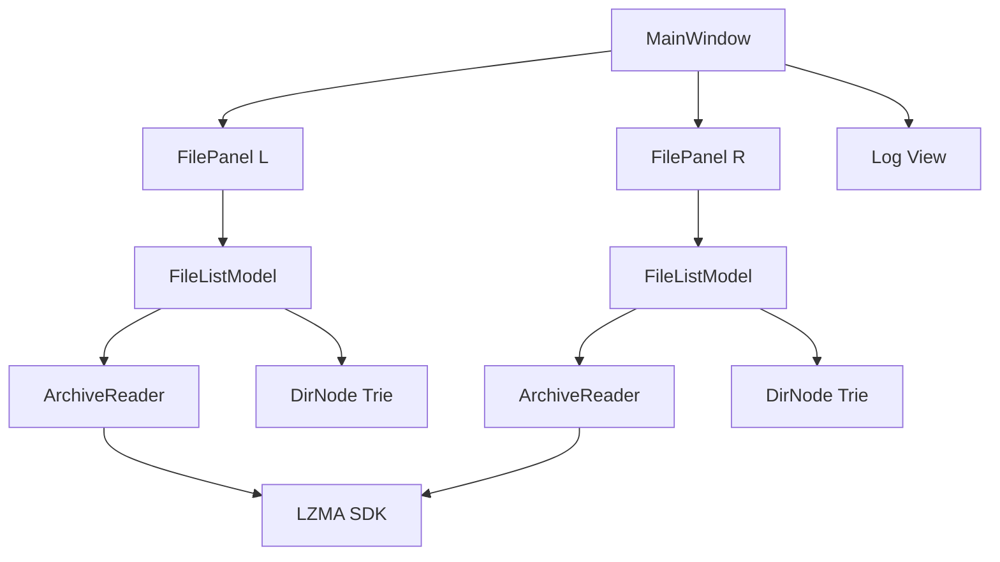

# 7z-fm — 7z File Manager

A dual-pane file manager (Total Commander style) with native 7z archive browsing and multi-threaded extraction, built with Qt 6 and the LZMA SDK.

## Features

- **Dual-pane** navigation with keyboard-driven workflow
- **Native 7z browsing** — enter archives like directories, instant navigation
- **DirNode trie index** — archive directory tree built once, O(depth) navigation
- **Virtual scroll** — only visible rows (~30) allocate data, handles 177K+ dirs
- **Multi-threaded extraction** — batch copy with 8 threads, 245 MB/s throughput
- **Tree caching** — `.7z.tree` cache file for instant re-opens
- **Yellow marking** — Space to mark files (Total Commander style), F5 to copy
- **Full row selection** — cursor highlights entire row

## Build

Requires Qt 6 and CMake:

```bash
mkdir build && cd build
cmake ..
cmake --build . -j$(nproc)
```

## Usage

```bash
./7z-fm
```

### Keyboard

| Key | Action |
|-----|--------|
| ↑↓ | Navigate |
| Enter | Open directory / enter archive |
| Backspace | Go up |
| Space | Toggle mark (yellow) |
| Tab | Switch panels |
| F5 | Copy marked files to other panel |
| F10 | Quit |

## Architecture



### Key Components

| Component | Role |
|-----------|------|
| `ArchiveReader` | LZMA SDK wrapper, index parsing, thread-safe extraction |
| `FileListModel` | QAbstractTableModel with virtual scroll, DirNode trie |
| `FilePanel` | Path bar + table + status bar widget |
| `MainWindow` | Dual-pane layout, copy logic, keyboard dispatch |

## Performance

Tested with a 36.6 GB archive containing 1.38M files in 177K directories:

| Operation | Time |
|-----------|------|
| Index parse (LZMA SDK) | 1,800 ms |
| Tree build (first open) | 430 ms |
| Tree from cache (repeat) | ~100 ms |
| Directory navigation | < 1 ms |
| Extract 97 files (8 threads) | 57 ms |
