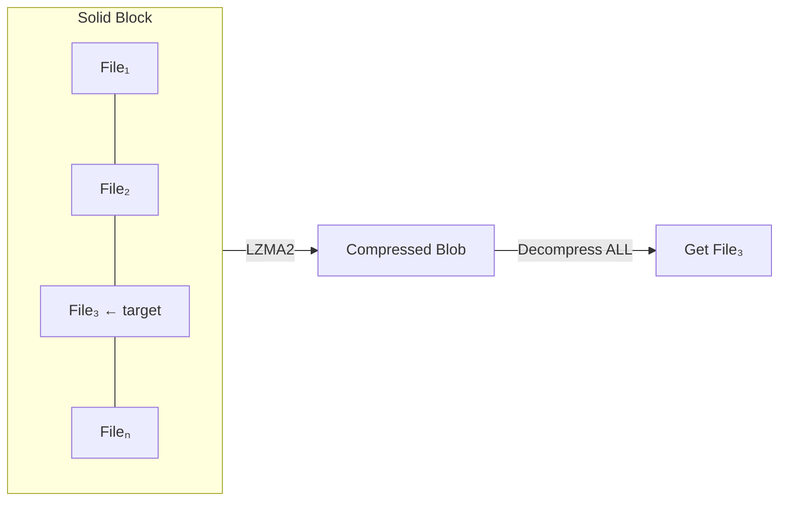
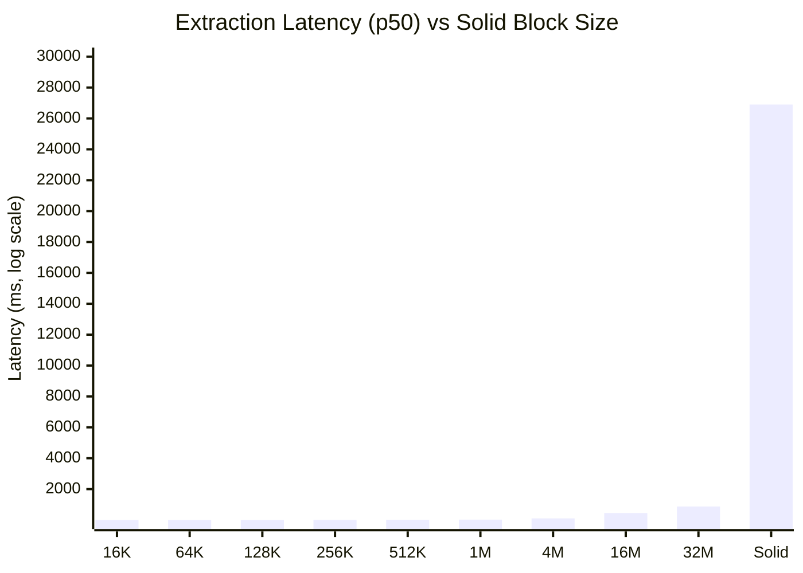

# 7z Experiments — Random Access Performance in 7z Archives

> **TL;DR**: When 7z archives are created with small solid blocks (`-ms=16k` to `-ms=128k`), individual files can be extracted in **under 1 millisecond** — making 7z viable as a read-only filesystem.

## The Question

Can a 7z archive serve as a practical random-access file store? The format is designed for sequential compression, but with the right parameters, can we extract arbitrary files fast enough for interactive use?

## Projects

| Directory | Language | Description |
|-----------|----------|-------------|
| [`7z-info`](7z-info/) | C | Archive structure analyzer — binary layout, block boundaries, per-file stats |
| [`7z-benchmark`](7z-benchmark/) | C | Systematic benchmark of extraction latency across dictionary × block size matrix |
| [`7z-fm`](7z-fm/) | C++ / Qt 6 | Dual-pane file manager with native 7z browsing and multi-threaded extraction |

All tools use the **LZMA SDK** (C API) directly — no `7z` command-line wrapper.

---

## Analysis & Conclusions

### The Critical Parameter: Solid Block Size

A 7z archive groups files into **solid blocks**. To extract one file, the entire block must be decompressed. This is the single most important parameter for random access performance.



> To extract File₃, the **entire** block must be decompressed. Smaller blocks = less waste = faster access.

### Benchmark Results: Block Size vs Extraction Latency

Tested on Apple Silicon (M-series), 1M dictionary, 20 cold extractions per configuration:



> ⚡ **269,000× difference** between solid (26.9s) and 16K blocks (0.1ms).

### Full Data Table

| Block Size | Blocks | p50 Latency | Max Latency | Verdict |
|------------|-------:|------------:|------------:|---------|
| **16 KB** | 29,213 | **0.1 ms** | 1.2 ms | ⚡ Instant |
| **64 KB** | 19,953 | **0.3 ms** | 2.3 ms | ⚡ Instant |
| **128 KB** | 9,645 | **1.3 ms** | 4.2 ms | ⚡ Instant |
| 256 KB | 4,079 | 4.9 ms | 8.7 ms | ✅ Fast |
| 512 KB | 1,930 | 12.4 ms | 16.8 ms | ✅ Fast |
| 1 MB | 940 | 24.8 ms | 34.1 ms | ✅ Acceptable |
| 4 MB | 230 | 104.5 ms | 129.0 ms | ⚠️ Noticeable |
| 16 MB | 58 | 451.0 ms | 490.6 ms | ❌ Slow |
| 32 MB | 29 | 873.8 ms | 942.8 ms | ❌ Slow |
| **Solid** | **1** | **26,898 ms** | **27,131 ms** | 🔴 Unusable |

> **269,000× difference** between solid and 16K blocks.

### Compression Ratio Trade-off

Larger blocks compress better, but the gains diminish rapidly:

| Block Size | Archive Size | Ratio | Savings vs Solid |
|------------|------------:|------:|:----------------:|
| 16 KB | 902.7 MB | 100.2% | -1.9% |
| 64 KB | 901.4 MB | 100.1% | -1.8% |
| 128 KB | 900.7 MB | 100.0% | -1.7% |
| 256 KB | 899.3 MB | 99.8% | -1.5% |
| 1 MB | 891.1 MB | 98.9% | -0.6% |
| 4 MB | 887.0 MB | 98.4% | -0.4% |
| 16 MB | 884.7 MB | 98.2% | -0.1% |
| **Solid** | **883.6 MB** | **98.0%** | **baseline** |

> Going from solid to 128K blocks costs only **1.7% more space** but makes extraction **350,000× faster**.

### Dictionary Size: Minimal Impact on Extraction

Dictionary size affects compression CPU time but has negligible effect on extraction latency at the same block size:

| Dict | Block=256K p50 | Block=1M p50 | Block=Solid p50 |
|------|---------------:|-------------:|----------------:|
| 64K | 3.4 ms | 23.9 ms | 1,647 ms |
| 1M | 4.9 ms | 27.1 ms | 7,109 ms |
| 16M | 4.9 ms | 24.8 ms | 26,898 ms |

At small block sizes, dictionary doesn't matter. At solid, larger dictionaries make things catastrophically worse because the entire archive is one block.

---

## The Recipe Archive Case Study

Real-world test: **recipes.7z** — 36.6 GB archive, 1,381,243 files in 177,832 directories.

This archive was created with **no solid blocks** (1 file per block), making it ideal for random access:

### Archive Browsing Performance

| Operation | Time | Notes |
|-----------|------|-------|
| LZMA SDK index parse | 1,800 ms | One-time, decompresses metadata header |
| DirNode trie build | 430 ms | One-time, builds navigable tree |
| Tree cache load | ~100 ms | Subsequent opens via `.7z.tree` file |
| Navigate to directory | < 1 ms | O(depth) pointer walk |
| Display 177K dirs | < 1 ms | Virtual scroll, no pre-allocation |

### File Extraction Performance

| Operation | Files | Wall Time | Throughput |
|-----------|------:|----------:|-----------:|
| Copy 2 folders | 52 | 6.1 ms | 245 MB/s |
| Copy 19 folders | 97 | 57.1 ms | 39 MB/s |

Multi-threaded extraction (8 threads), files written to SSD.

### Optimization Journey

| Version | Tree Build | Total Open | Improvement |
|---------|--------:|----------:|:-----------:|
| Initial (O(n) scan) | 4,400 ms | 6,200 ms | baseline |
| DirNode trie | 4,400 ms | 6,200 ms | structure only |
| QMap → QHash | 739 ms | 2,539 ms | **2.4×** |
| Deferred file data | 426 ms | 2,226 ms | **2.8×** |
| Raw SDK buffers | 414 ms | 2,214 ms | **2.8×** |
| + Tree caching | ~100 ms | ~1,900 ms | **3.3×** |

---

## Conclusions

### ✅ 7z CAN be used for fast random access — if created properly

1. **Use small solid blocks**: `-ms=16k` to `-ms=128k` gives sub-millisecond extraction with only 1-2% compression penalty
2. **Dictionary size doesn't matter** for extraction at small block sizes — use whatever gives the best compression ratio
3. **Avoid solid archives** (`-ms=on` or default) for random access — they're 269,000× slower

### ✅ Archive browsing can be instant

1. **DirNode trie** with O(depth) lookup replaces O(n) scanning
2. **Virtual scroll** — model returns data on-the-fly, no pre-allocation of 177K+ entries
3. **Tree caching** — serialize tree to disk, load in 100ms on repeat opens

### ✅ Multi-threaded extraction is effective

With 1-file-per-block archives, each file is independent → trivially parallelizable. 8 threads achieved 245 MB/s throughput on small files.

### Recommended Archive Creation

```bash
# For archives that need random access (recommended):
7z a -m0=lzma2:d=1m -ms=128k archive.7z files/

# For maximum random access speed:
7z a -m0=lzma2:d=1m -ms=16k archive.7z files/

# For pure archival (no random access needed):
7z a -m0=lzma2:d=16m archive.7z files/
```

---

## Building

Each subproject builds independently:

```bash
# 7z-info (C, make)
cd 7z-info && make

# 7z-benchmark (C, make)
cd 7z-benchmark && make

# 7z-fm (C++/Qt 6, CMake)
cd 7z-fm && mkdir build && cd build && cmake .. && cmake --build . -j$(nproc)
```

## Requirements

- C compiler (GCC, Clang, MSVC)
- Qt 6 (for 7z-fm only)
- CMake 3.20+ (for 7z-fm only)
- `7zz` CLI tool (for benchmark archive creation only)

## License

LZMA SDK is public domain. Project code is MIT.
